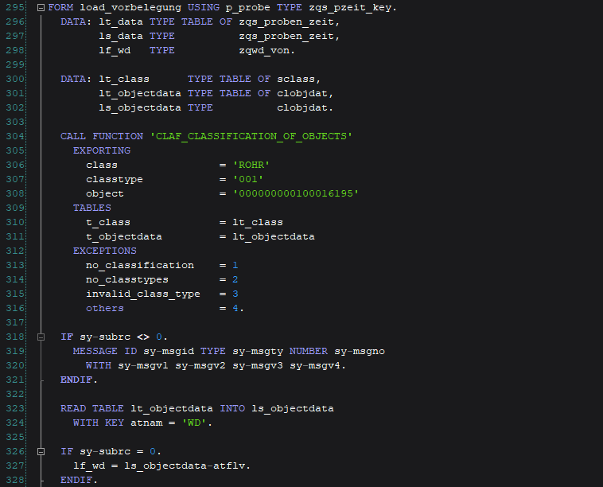

# ABAP Editor Dark Theme

Installation
============
Navigate to `%appdata%\SAP\SAP GUI\ABAP Editor\` and create a backup of your current theme file `abap_spec.xml`.
Then, replace the `abap_spec.xml` with the new theme file.
Restart SAPgui and enjoy your new theme!